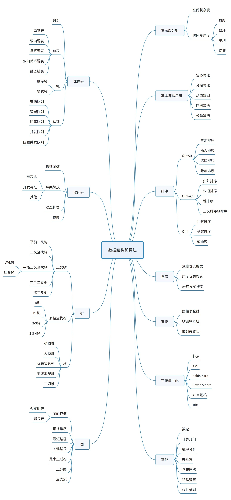
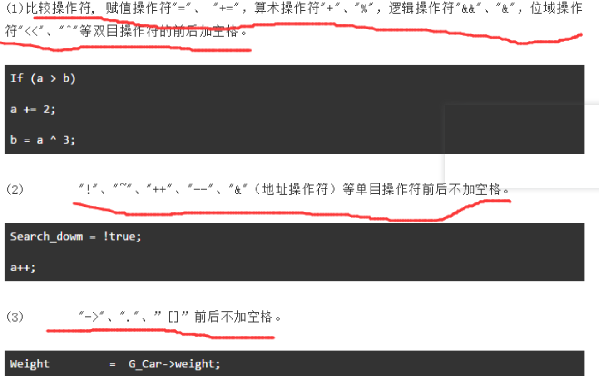
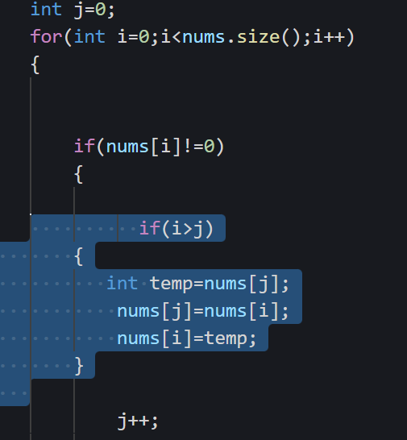
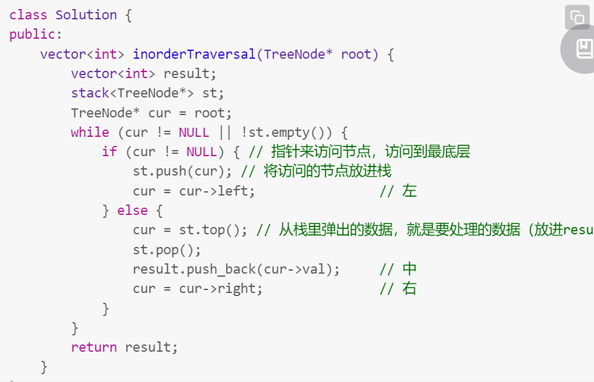

腾讯腾讯腾讯

#==一.codestyle==
space支'if 'adding space behind it
2.

#==二.极(or多)频  否我模周 体尝组路否预:==
##==zero.== 
|algorithms制图v 首备后绕|||
-|-|-|-|-|-|-|
|1.存换对||||
|2.最果悔原势制路数||||
|3.体尝我他外组频路数|||||
|4.==存==物用制规==舍==周单频中制盖总or不need被模认为影对|||
||

|algorithms ==体尝==空组周单频的most原图v|||
-|-|-|-|-|-|-
|1.if else分映原条影 →制路数1. if()......同时思插图v| |||
|2.for(过个支周) while(分映支周) 日积or舍积支周:支规周单频用||||
|3.recursion 等分换首首推:用前印规记存物,等果分段 后首备后+首备后..... and达果||||
==迭代是规存影指过换，用临时变量保存结果；递归:法映触用我支法映首备后内分首备后绕后,tgt:LeetCode,94. Binary Tree Inorder Traversal;==
##==0.5.==

|most 原图v==思路==支||||||
-|-|-|-|-|-|-
|**①most原**|1.==a.思字盖and映*数*果图v== ==(1)==.我刷题八影：不能用 字盖 映 具体数化体尝的能**数**果图v  tgt：for映周过（到周停止） while到分映条影停止 ==b.思等换物果图v==:条影能达果等换物(原)+空组物组规物(外) 组规sgt:(leetcode min stack)条影等换 ==(1)== pop()之前的栈 第二首的min() (第二小)==(2)== pop()之后的栈 第一首的min(还是第一小)==(2)等换物能达果because 一直存最小min价即可==|2.写物影sgt int i,j|3. 写法路映==法路映周单频:一般个图v+极影个图v==and return 果图v|
|**②细插**|3.首: 周物影单频+条支分映|备: 用单(from easy to hard) 3(**because周单频在条影下被盖图v总达→单3**) **+** 用前记存物(频能是换对sgt climbing stairs way=way1+way2→换对 **从果分段否预+分段规同+从单3的0段用规支周积 达果**) 从而舍多个支周算同果的tgca|||
|||

##1.
|分映支|
-
|if能果:对一段否影two条分映进行two体尝|
|only 2 results 条影分映用 ? :   (?等换物→if  :等换物→else)|

 
##2.
|array 支:| |
-|-|-
|用数组首下等换数价,数组价1/0等换舍or用(sgtpat第五题)数组不能过界访问 sgt num[10]={0},num[temp]=1/0|hjh 
| |

##3.
|地标首备后支|||
-|-|-|-|-|-|-
|1.cout<<' ' ;space放left达比left更高价(sgtpat第五题), in left we can 5决 the last cout换对 havnt space being cout;
改动某个指令地标首备低影,because之前换对被体尝的首备 换更,导致原先我摸推的否预不能推了sgt    leetcode283move zeroes if(i>j)放if nums[i]上  nums[i]不能首体尝不行   放下面j首++影响i>||||
|||||

#==三.回图v达比否预==

|1.find error|||
-|-|-|-|-|-|-
|1.一段一段找||||
|2.不用模糊的不预印规改错代码|sgt:**不预印规不分映题细插制  本来对了 but自己写完我模认为自己写错**
      sgt:>code  >`leetcode11`
      int i=0,j=height.size()-1,area = 0;
       while(i < j)
       {
        area = height[i]<height[j] ? 
        max(area, (j-i) * height `[i++]` ) : 
        /*不预印规不分映题细插制  本来对了 自己写完我模自己写错
       //换更写成: max(area, (j-i) * height `[j++]` ) :
         //       max(area, (j-i) * height`[i--]`);*/
         max(area, (j-i) * height`[j--]`);
         
       } 
         return area;
     
|3.|||
-|-|-|-|-|-|-
||for int i=0不触->lead compile right but solve problem error|||
|||||

 |4.|存充(满)|无存|
-|-|-|-|-|-|-
||注集固定内存container|sgt: stack<char> st;...after many codes...using st.top() st.pop()||
|||||

|5.|分思code映物插果图v时用盖总的中规舍不必要的多杂远烦人分思  and==思规一达==(except规推不能,没有路不了的否预||
-|-|-|-|-|-|-
||sgt: 不分映binary tree的指推过周(迭代遍历)but一个一个过图v分思插果图v太麻烦 and==写太多①纸写不下②隔tgcao不触前果图v的周指过段and首备后== **③**太多杂过插图v让分思多次中断==and一天下来一个路后贼easy的否预一直拖着 and根本路不了(because3极必反规:分思的对路太多导致放弃思插图v),也不extremely不愿路那一大串多杂远否预== sgt:**中规推:while支周等于最左lef 影换right一直推**|||
|||||

|6. |原换对被路指了一个new换对不预印规写原对||
-|-|-|-|-|-|-
|| **用i等换周个n的价 结果不预印规写只写n不触路指换更的i**|||
|||||

7
